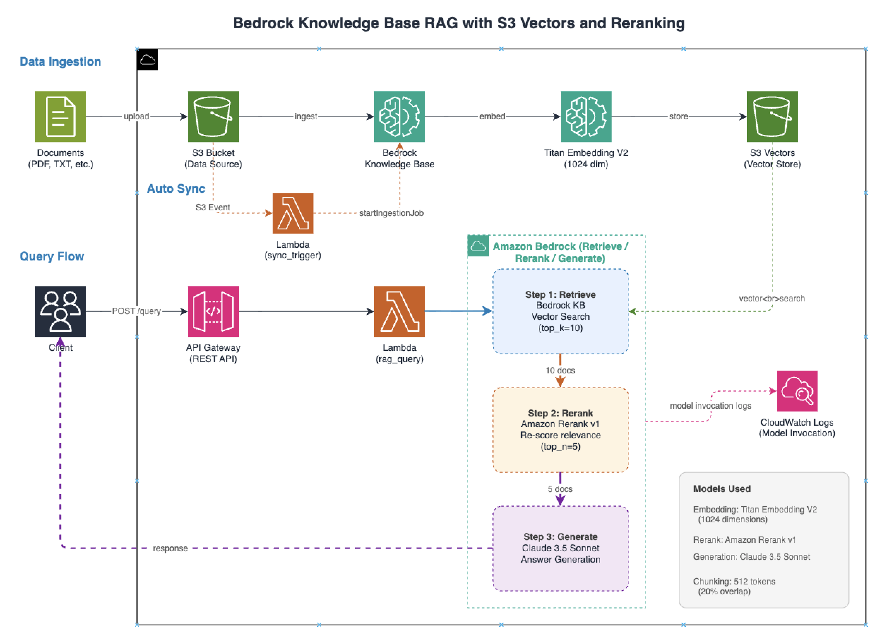

# bedrock-kb-s3vectors-rerank-rag

A sample CDK project that implements RAG (Retrieval-Augmented Generation) using Amazon Bedrock Knowledge Bases with S3 Vectors and Reranking. A single `cdk deploy` sets up a complete RAG environment with reranking.

[Japanese (日本語)](README.ja.md)

## Overview

This project demonstrates how to build a RAG system using:

- **Amazon Bedrock Knowledge Bases** for document ingestion and retrieval
- **Amazon S3 Vectors** as the vector store (no separate vector database required)
- **Amazon Rerank v1** for improving search relevance through reranking
- **Claude 3.5 Sonnet** for answer generation

## Architecture




## Prerequisites

- AWS Account
- The following Bedrock model access enabled:
  - Amazon Titan Text Embeddings V2
  - Amazon Rerank v1
  - Anthropic Claude 3.5 Sonnet v2 (APAC inference profile)
- Node.js 18+
- pnpm
- AWS CDK CLI

## Deployment

```bash
git clone https://github.com/furuya02/bedrock-kb-s3vectors-rerank-rag.git
cd bedrock-kb-s3vectors-rerank-rag/cdk
pnpm install
pnpm cdk bootstrap  # first time only
pnpm cdk deploy
```

After deployment, the following are automatically executed:
- S3 Vectors bucket and index creation
- Bedrock Knowledge Base setup
- Sample document upload to S3
- Data source sync (ingestion job start)

Please wait 1-2 minutes after deployment for the ingestion job to complete.

## Usage

Use the `QueryEndpoint` shown in the deployment output to run queries.

```bash
curl -X POST <QueryEndpoint> \
  -H "Content-Type: application/json" \
  -d '{"query": "What is S3 Vectors?"}'
```

### Sample Queries

```bash
# About S3 Vectors
curl -X POST <QueryEndpoint> \
  -H "Content-Type: application/json" \
  -d '{"query": "S3 Vectorsとは何ですか？"}'

# How reranking works
curl -X POST <QueryEndpoint> \
  -H "Content-Type: application/json" \
  -d '{"query": "リランキングの仕組みを教えてください"}'

# Lambda memory limits
curl -X POST <QueryEndpoint> \
  -H "Content-Type: application/json" \
  -d '{"query": "Lambdaのメモリ制限はいくつですか？"}'
```

### Adding Documents

Documents added to the S3 bucket are automatically synced to the Knowledge Base.

```bash
aws s3 cp your-document.txt s3://<DataSourceBucketName>/
```

Documents are also automatically synced when deleted.

### Verifying Rerank Behavior (CloudWatch Logs)

By enabling Bedrock model invocation logging, you can view the rerank input (documents from vector search) and output (`relevance_score` re-evaluation) in CloudWatch Logs.

**Enable logging:**

Bedrock Console → Settings → Model invocation logging → Enable CloudWatch Logs

**View logs:**

```bash
aws logs filter-log-events \
  --log-group-name /aws/bedrock/model-invocation-logs \
  --filter-pattern '"amazon.rerank"' \
  --region ap-northeast-1 \
  --query "events[].message" --output text
```

The logs contain:

- **inputBodyJson**: Documents from vector search (`documents`) and the query (`query`)
- **outputBodyJson**: Each document's `relevance_score` (reranked score) and `index` (original position)

```json
{
  "operation": "InvokeModel",
  "modelId": "arn:aws:bedrock:...foundation-model/amazon.rerank-v1:0",
  "input": {
    "inputBodyJson": {
      "documents": ["Document 1...", "Document 2...", ...],
      "query": "What is S3 Vectors?"
    }
  },
  "output": {
    "outputBodyJson": {
      "results": [
        {"index": 0, "relevance_score": 0.9604},
        {"index": 3, "relevance_score": 0.0062},
        ...
      ]
    }
  }
}
```

### API Parameters

| Parameter | Type | Default | Description |
|-----------|------|---------|-------------|
| `query` | string | (required) | The search query |
| `top_k` | int | 10 | Number of documents to retrieve from KB |
| `top_n` | int | 5 | Number of documents to keep after reranking |

### Response Format

```json
{
  "answer": "Generated answer based on retrieved documents",
  "sources": [
    {
      "content": "Relevant document excerpt...",
      "rerank_score": 0.95,
      "location": {}
    }
  ],
  "retrieved_count": 10,
  "reranked_count": 5
}
```

## Project Structure

```
cdk/
├── bin/
│   └── app.ts                              # CDK app entry point
├── lib/
│   └── bedrock-kb-s3vectors-rerank-stack.ts # Main CDK stack
├── lambda/
│   ├── rag_query/
│   │   ├── handler.py                       # RAG query with reranking
│   │   └── requirements.txt
│   └── sync_trigger/
│       └── handler.py                       # Auto-sync KB on S3 events
├── package.json
├── tsconfig.json
└── cdk.json
sample_data/                                 # Sample documents (auto-uploaded)
```

## How It Works

1. **Document Ingestion**: Documents uploaded to S3 are chunked (512 tokens, 20% overlap) and embedded using Titan Embedding V2 (1024 dimensions), then stored in S3 Vectors
2. **Auto Sync**: File additions/deletions in the S3 bucket are detected and automatically trigger an ingestion job via Lambda
3. **Retrieval**: When a query is received, it is embedded and used to search the S3 Vectors store for the top-k most similar documents
4. **Reranking**: Retrieved documents are reranked using Amazon Rerank v1 to improve relevance ordering
5. **Generation**: The top-n reranked documents are used as context for Claude 3.5 Sonnet to generate a final answer

## AWS Resources Created

| Resource | Description |
|----------|-------------|
| S3 Bucket | Document data source |
| S3 Vectors (Custom Resource) | Vector bucket and index for embeddings |
| Bedrock Knowledge Base | RAG knowledge base with S3 Vectors |
| Bedrock Data Source | S3 data source configuration |
| Lambda Function (rag_query) | RAG query handler (Python 3.13) |
| Lambda Function (sync_trigger) | Auto-sync KB on S3 events |
| API Gateway | REST API endpoint |
| IAM Roles | Roles for KB and Lambda |

## Configuration

The project name is configured in `cdk/cdk.json`:

```json
{
  "context": {
    "projectName": "bedrock-kb-s3vectors-rerank-rag"
  }
}
```

This value is used as a prefix for all resource names.

## Cleanup

```bash
pnpm cdk destroy
```

## License

MIT License

## Contributing

Contributions are welcome! Please feel free to submit a Pull Request.
